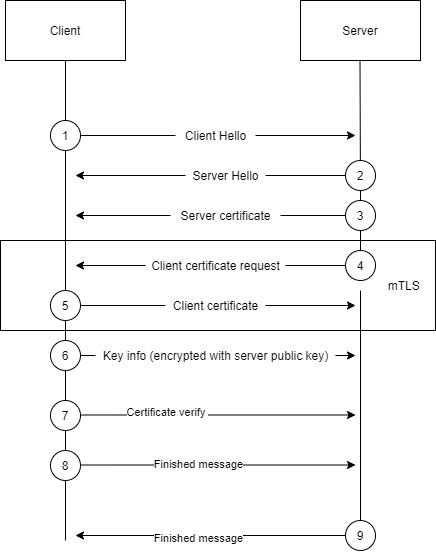
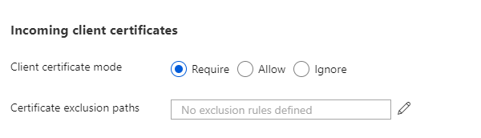
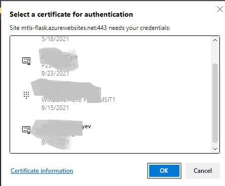
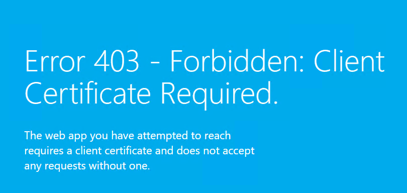

# TLS mutual authentication with Flask

Configuration of mTLS support in Azure App Services described in document [Configure TLS mutual authentication - Azure App Service | Microsoft Docs](https://docs.microsoft.com/en-us/azure/app-service/app-service-web-configure-tls-mutual-auth). It provide a code examples for ASP.NET 5+, ASP.NET Core 3.1, ASP.NET WebForms , Node JS and Java. 
The purpose of this tutorial is to provide an example of using Python Flask with cryptography package on Azure App Services for mTLS authentication.

## Overview
I'll provide code example and App Service deployment configuration for mTLS support. Python code will do basic HTTP/s header dump along with decoding of the certificate fields like 'serial', 'version', 'subject', validity and so on. 

## Background

In the TLS1.2 Handshake, the mTLS request occurs at steps 4 ( Client Certificate Request ) and 5 ( Client Certificate )



At the time of writing this article, mTLS was [supported](https://docs.microsoft.com/en-us/azure/app-service/app-service-web-configure-tls-mutual-auth#prepare-your-web-app) by Azure App Services' Basic, Standard, Premium, and Isolated tiers.
In App Service, TLS termination of the request happens at the frontend load balancer. When forwarding the request to the app code with [client certificates enabled](https://docs.microsoft.com/en-us/azure/app-service/app-service-web-configure-tls-mutual-auth#enable-client-certificates), App Service injects an `X-ARR-ClientCert` request header with the client certificate. App Service does not do anything with this client certificate other than forwarding it to the app. Note, the code provided do not perform actual certificate validation. Validation might be provided in upcoming releases though. 

Incoming certificates can be enabled via Configuration->General settings -> Incoming Client Certificates



## Scenario

To deploy provided flask application you might follow easy steps below :

- Have an Azure account with an active subscription.  [Create an account for free](https://azure.microsoft.com/free/?ref=microsoft.com&utm_source=microsoft.com&utm_medium=docs&utm_campaign=visualstudio).
- Install  [Python 3.6 or higher](https://www.python.org/downloads/).
- Install the  [Azure CLI](https://docs.microsoft.com/en-us/cli/azure/install-azure-cli), with which you run commands in any shell to provision and configure Azure resources.
- Clone the sample 
```bash
git clone https://github.com/myers-dev/mtls
```
- Create virtual environment
```bash
python3 -m venv .venv
source .venv/bin/activate
```
- Install dependencies
```bash
pip install -r requirements.txt
```
- Verify if everything runs correctly by launching the development server
```bash
flask run
``` 
- Deploy the code and enable client certificates
```bash
az webapp up --sku P1V3 --name mTLS-flask --location eastus --resource-group mTLS 
az webapp update --set clientCertEnabled=true --name mTLS-flask --resource-group mTLS 
az webapp log tail --name mTLS-flask 
```

 By navigating to the webapp page you will be asked to provide the certificate.



And application will dump all headers and certificate content ( base64-encoded )


Note, if "Required" option is selected and you decline to provide the certificate , you will get "Error 403 - Forbidden: Client Certificate Required."



In scenarios where AppService is front-ended by AppGateway, mTLS is not supported. This occurs because AppGateway terminates SSL. As a result, a new SSL session will be established to the backend, breaking any SSL authentication. Regardless of whether the non-mTLS health checks can be resolved through AppGateway (see /healthz in the code ), the "certificate request" message from AppService will not be translated into the Client->AppGateway leg. 

